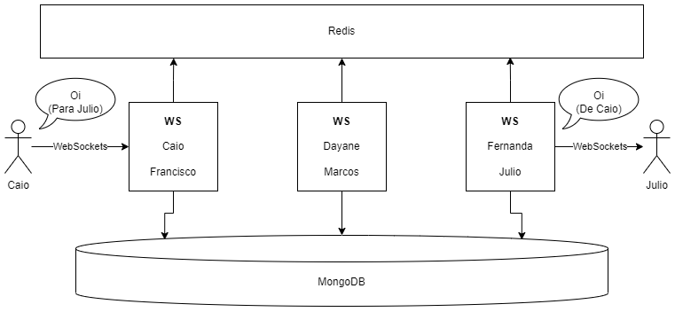

# Projeto de Chat com WebScoket em Java - Spring Boot

<div style="text-align: center;">


</div>

Este é um projeto de chat que utiliza tecnologias como Spring Boot, WebSockets, Redis, Gradle, Java 17, Docker, Auth0, MongoDB, Nginx, HTML, JS e CSS. O objetivo é criar um chat em tempo real que permite a comunicação entre os usuários através de uma interface web.

## Tecnologias Utilizadas

Aqui estão as principais tecnologias usadas no projeto:


## Arquitetura do Projeto

O projeto é dividido em duas partes principais: o backend e o frontend.

### Backend

O backend é desenvolvido em Spring Boot e utiliza WebSockets para permitir a comunicação em tempo real entre os clientes. Além disso, é implementada a proteção utilizando o JWT do Auth0 e Tickets para garantir a autenticação dos usuários. O padrão Pub/Sub é adotado utilizando o Redis para otimizar a troca de mensagens entre os diferentes componentes do sistema.

O backend também é responsável por interagir com o banco de dados MongoDB para salvar e recuperar alguns dados dos usuários.

### Frontend

O frontend é desenvolvido utilizando HTML, JS e CSS para criar uma interface web simples de chat. Ele se conecta ao backend através de WebSockets para enviar e receber mensagens em tempo real.

### Diagrama



## Executando o Projeto

Para executar o projeto, siga os passos abaixo:

1. Certifique-se de ter o Docker instalado em sua máquina.

2. Clone este repositório.

3. No terminal, navegue até o diretório do projeto e execute o seguinte comando para iniciar o backend, Frontend e o banco de dados:

```bash
docker-compose up -d --build
```

4. Acesse o frontend em seu navegador através do endereço: `https://localhost`.

5. Agora, você pode utilizar o chat em tempo real para se comunicar com outros usuários conectados.

## Demo
https://github.com/danielfalcaodf/chat-spring-boot-redis-ws/assets/43100709/72f2da02-f9ad-489c-af43-eb7e121ea89d


## Considerações Finais

Este projeto demonstra o uso de várias tecnologias modernas para criar um chat em tempo real escalável e altamente disponível. Sinta-se à vontade para explorar o código-fonte e adaptá-lo para suas próprias necessidades.

Se tiver alguma dúvida ou encontrar algum problema, sinta-se à vontade para entrar em contado em danielfalcao.df@gmail.com

Divirta-se codificando! 🚀
